## Trabalho da disciplina Sistemas Operacionais

#### Nome dos integrantes:

- Bárbara Santos Vilela
- Leticia Brasil Flores
- Luiz Felipe Porto Lara de Oliveira 

O trabalho está dividido nas seguintes etapas:

- **1A** = Gerente de Memória e Gerente de Processos com partições fixas 

- **1B** = Troca de Gerente de Memória para Paginação

Para executar o programa basta localizar a função main de cada arquivo e rodar. Será exibido o seguinte menu de opções:

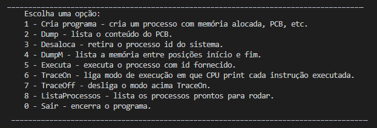

Ao executar a opção 1, o usuário deve escolher um dos programas disponíveis na lista:
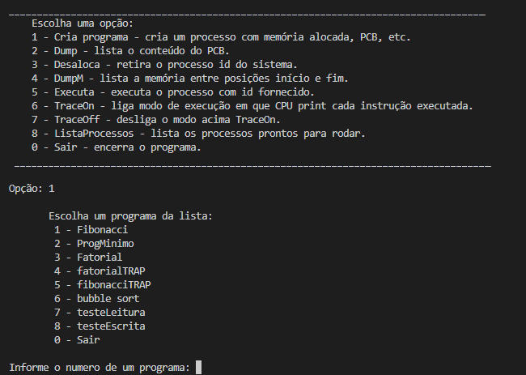

Como resultado será exibido:

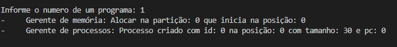

Após inserir um ou mais programas, os mesmos poderão ser executados, selecionando a opção 5 e em seguida informando o id do programa. As demais opções, como listar os processo, exibir memória a partir de um intervalo, e ativar debug, ficam disóníveis ao usuário durante a execução.
Para encerrar a execução, digitar o valor 0.

### Seção implementação

O programa aplica a lógica corretamente, tanto de partições fixas como de paginação, sendo possível: alocar, fazer o dump, desalocar e executar um programa específico programa (Fibonacci).
Nos itens abaixo, descrevemos as situações que estão pendentes até o momento:

- Os testes realizados com sucesso até o momento, foram feitos utilizando o programa Fibonacci em ambos casos (partições e paginação). Os testes realizados com outros programas como fatorial, fatorial TRAP falharam durante a execução.
O erro recebido está no acesso a endereço de memória inválido, até o momento o que conseguimos apurar é que, no exemplo do programa Fatorial, o progama tenta endereçar a posição 10 da memória ([ STD, 1, -1, 10  ]). 

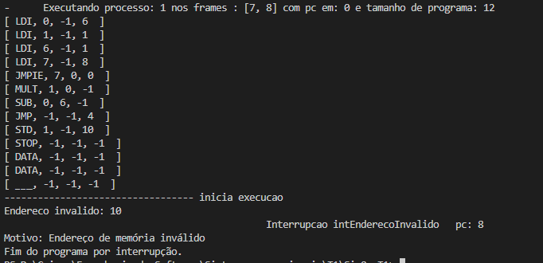

- Está pendente a implementação das fuções que envolvem acesso a memória compartilhada, SHMALLOC e SHMREF.

### Seção Testes

Nesta seção apresentamos os resultados obtidos com os testes realizados.

##### Teste 1A - Partições fixas

- Listanto os processos prontos para rodar:

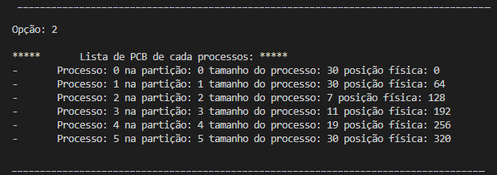

- Removendo o processo de Id 4

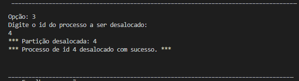

- Exibindo litsa de processos prontos após remover processo 4:

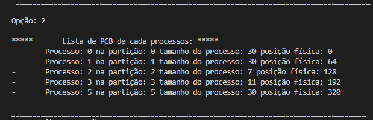

- Dump da memória por intervalo, como por exemplo, da posição 60 até 100.

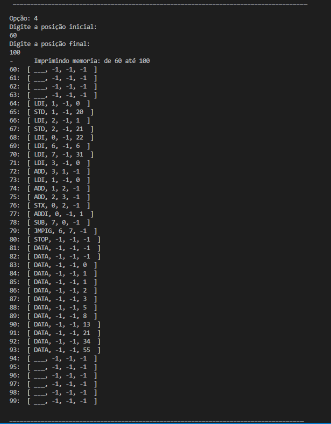

Ao utilizar a opção de Dump da memória é possível observar que o processo de Id 2 está alocado na segunda partição que inicia na posição 64 da memória.

##### Teste 1B - Paginação

Com relação a paginação, ao inserir um novo programa, é retornada a seguinte mensagem informando os frames em que o programa foi alocado.

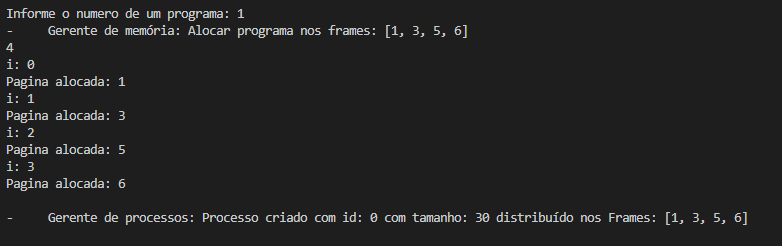

Assim como pode ser verificado na lista de PCBs, onde será exibido o programas e seus respectivos frames.

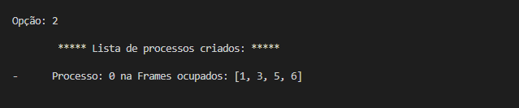

Quando realizado o dump da memória de 0 até 100, pode-se observar que o programa está alocado nos frames indicados, seguindo a lógica de paginação, que possui tamanho 8, nesse exemplo.

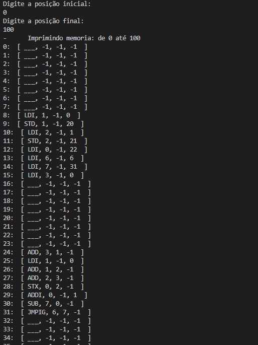

Ao executar o programa, nesse exemplo rodamos o programa Fibonacci, obtemos o resultado esperado.

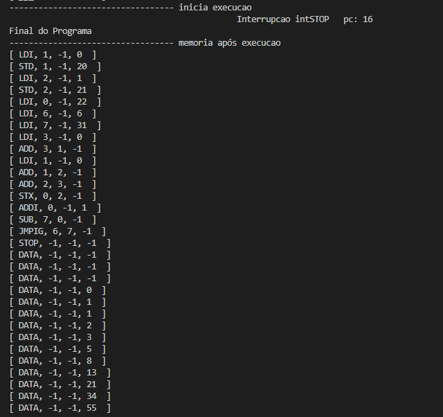
 