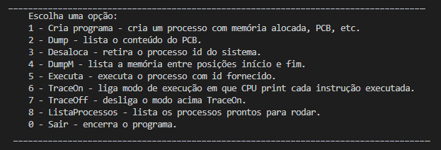
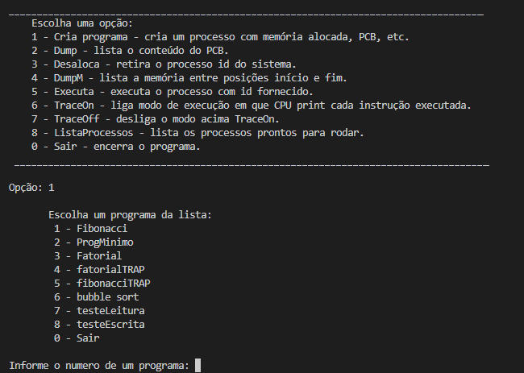
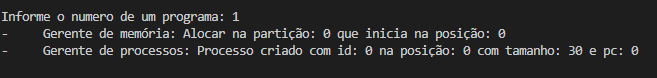
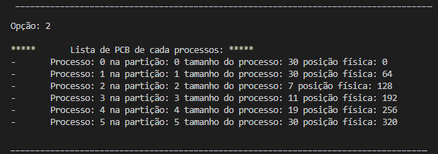
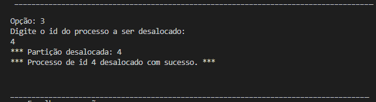
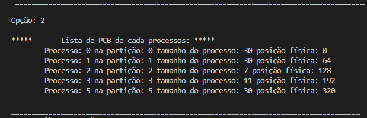
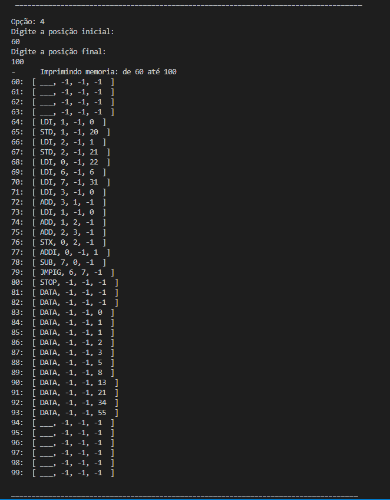

## Trabalho da disciplina Sistemas Operacionais

#### Nome dos integrantes:

- Bárbara Santos Vilela
- Leticia Brasil Flores
- Luiz Felipe Porto Lara de Oliveira 

O trabalho está dividido nas seguintes etapas:

- **1A** = Gerente de Memória e Gerente de Processos com partições fixas 

- **1B** = Troca de Gerente de Memória para Paginação - pendente

Para executar o programa basta localizar a função main de cada arquivo e rodar. Será exibido o seguinte menu de opções:

Ao executar a opção 1, o usuário deve escolher um dos programas disponíveis na lista:

Como resultado será exibido:

Após inserir um ou mais programas, os mesmos poderão ser executados, selecionando a opção 5 e em seguida informando o id do programa. As demais opções, como listar os processo, exibir memória a partir de um intervalo, e ativar debug, ficam disóníveis ao usuário durante a execução.
Para encerrar a execução, digitar o valor 0.

### Seção implementação

 Informe se seu programa implementa todas as características solicitadas.
 
 E se há alguma restrição (situação que não está funcionando).

### Seção Testes

Para cada teste (cenário de execução) indique como executar e o resultado esperado em cada caso.

##### Teste 1A - Partições fixas

- Listanto dos os processos prontos para rodar:

- Removendo o processo de Id 4

- Exibindo litsa de processos prontos após remover processo 4:

- Dump da memória por intervalo, como por exemplo, da posição 60 até 100.

Ao utilizar a opção de Dump da memória é possível observar que o processo de Id 2 está alocado na segunda partição que inicia na posição 64 da memória.

##### Teste 1B - Paginação

 